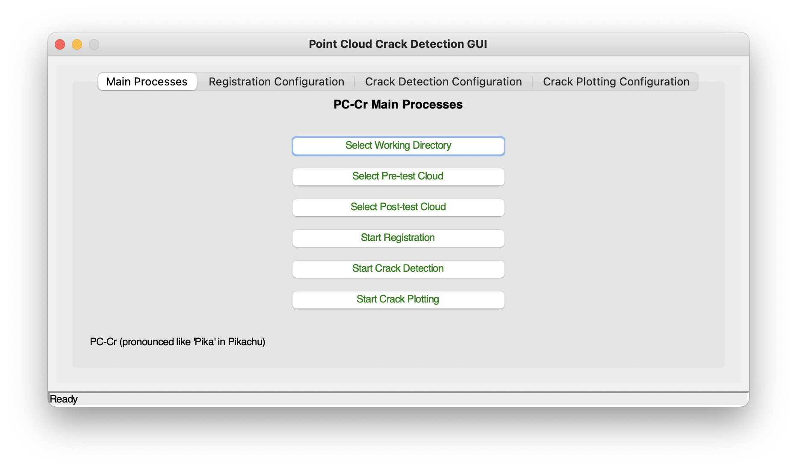
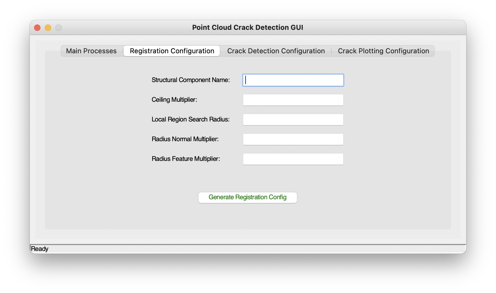
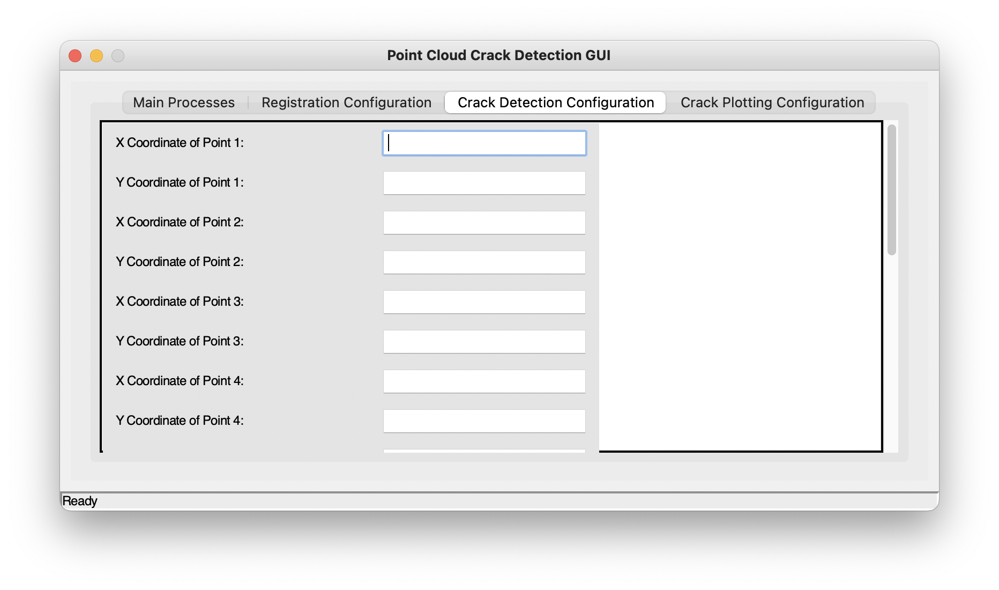
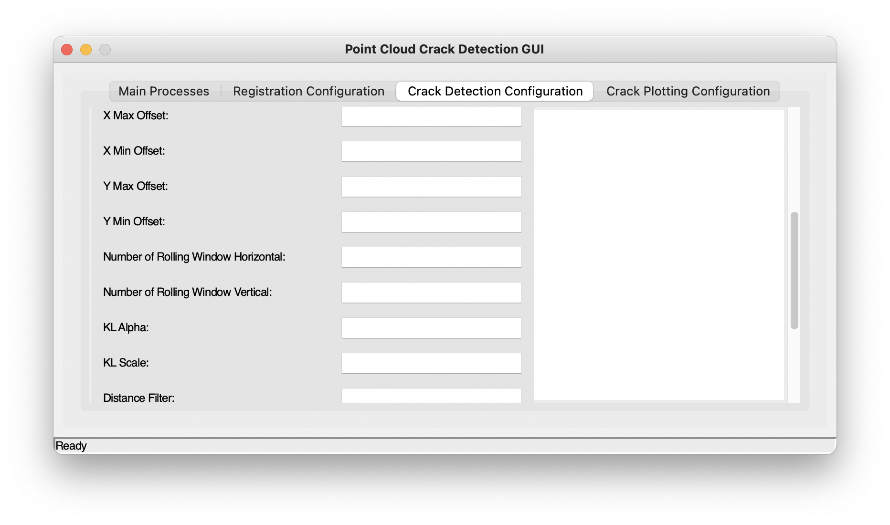
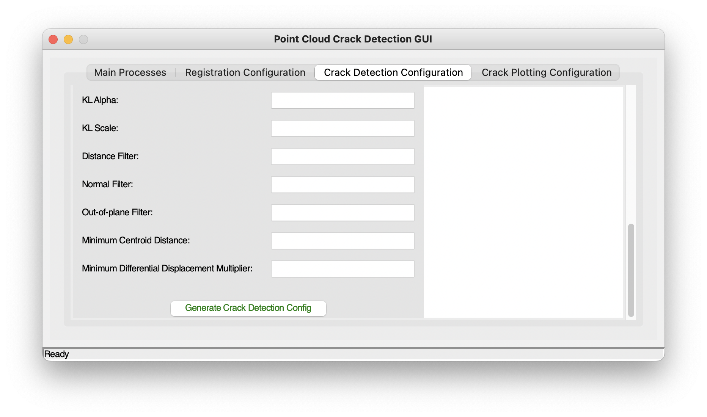
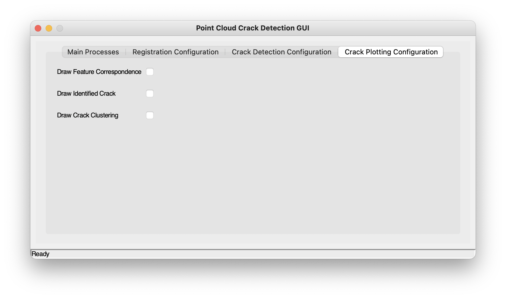

# PC-Cr (pronounced like "Pika")

**PC-Cr** is a software package implementing the PC-CR method for detecting and measuring cracks in segmented structural components using point clouds taken before and after a deformation event. The PC-CR method is detailed in Chapter 8 of Yiyan Liu's DPhil thesis on [*Displacement and Damage Monitoring for Masonry Buildings Subjected to Ground Movements Induced by Underground Construction*](https://ora.ox.ac.uk/objects/uuid:b5337a6a-c9fc-4c3b-b456-05751eb3d353).

## Features

- **Feature Registration**: Implements the FPFH feature calculation and matching process based on the local region-based search algorithm for displacement analysis as described in Section 6.2.3 of Yiyan Liu’s DPhil thesis.
- **Crack Detection and Measurements**: Utilises the PC-Cr method to detect and measure cracks on unstructured surfaces by analysing the derived rigid motions of feature point clusters, based on inferred displacements from feature matching.
- **Crack and Cluster Visualisation**: Uses Matplotlib and Open3D for visualisation of feature matching, identified and measured cracks, and feature point clusters.
- **GUI Module**: Provides a graphical user interface (GUI) for the implementations mentioned above.

## Installation

### Prerequisites

Before installing **PC-Cr**, ensure that you have the following installed:

- Python 3.10.14
- `matplotlib==3.7.2`
- `numpy==1.25.1`
- `open3d==0.16.0`
- `pandas==2.0.3`
- `scikit-learn==1.3.0`
- `scipy==1.11.1`
- `shapely==2.0.1`
- `tqdm==4.65.0`

### Using Conda

You can create a new virtual environment and install the package using Conda:

```bash
conda create --name pc_cr_env python=3.10.14
conda activate pc_cr_env
# Change to the directory where the pc_cr package is located
cd /path/to/pc_cr  
pip install -e .
```
## Usage

### Launch GUI

```bash
pc_cr_gui
# or
python -m pc_cr.gui.gui
```
### Using GUI
- Select Working Directory: Select a working directory by clicking Select Working Directory button.

- Select Pre-test Cloud: Select the pre-test point cloud in .txt format by clicking Select Pre-test Cloud button. This is the point cloud before the deformation event.
- Select Post-test Cloud: Select the post-test point cloud in .txt format by clicking Select Post-test Cloud button. This is the point cloud after the deformation event.
- Start Registration: Perform feature registration task by clicking Start Registration button. This button only works after registration configuration file is generated.
- Start Crack Detection: Perform crack detection and measurement task by clicking Start Crack detection button. This button only works after crack detection configuration file is generated.
- Start Crack Plotting: Perform crack tasks by clicking tart Crack Plotting button. This button only works if one of the options on Crack Plotting Configuration tab is selected.

- Both point clouds should be registered to the same coordinate system and aligned such that the X-axis corresponds to the minor axis. In the 2D representation of the façade, the Y-axis of the original cloud becomes the X-axis, and the Z-axis becomes the Y-axis for subsequent crack detection and measurements. Draw feature correspondence only works after feature registration task is complete. Draw identifed crack and draw crack clustering only works crack registration is complete and at least a crack segment is detected.



- Go to Registration Configuration tab.



- Structural Component Name: Enter a name for the structural component in Structural Component Name.

- Ceiling Multiplier: Specify a ceiling multiplier by entering a value in Ceiling Multiplier. This value is used for re-sampling voxel size and is defined as a multiple of the larger value of the average point density between the pre- and post-test point clouds (typically set at 1.2).
- Local Region Search Radius: Specify a local region search radius by entering a value in (m). This should be based on the estimated maximum displacement sustained by the structure between the pre- and post-test clouds, multiplied by a safety factor. An unnecessarily large value will result in considerable processing time for high-dimension feature matching. In the Turkey test, for a building that sustained 35mm of settlement, a value of 0.15m was used for demonstration purposes. If a good estimate can be obtained, this should be set relatively close to the estimated maximum displacement.
- Radius Normal Multiplier: Specify a value to define the radius for FPFH normal calculation. The multiplier is applied to the re-sampling voxel size to determine the radius for normal calculation (usually set at 3—a sensitivity analysis is provided in Yiyan Liu's thesis).
- Radius Feature Multiplier: Specify a value to define the radius for FPFH feature calculation. The multiplier is applied to the re-sampling voxel size to determine the radius for feature calculation (usually set at 6—a sensitivity analysis is provided in Yiyan Liu's thesis).
- Once all parameters are provided, click Generate Registration Config to generate the configuration file in the working directory as a .py file. The configuration template is stored in pc_cr/pc_cr/gui/.



- X/Y Coordinate of Point 1/2/3/4: Enter the X and Y coordinates (corresponding to the Y and Z coordinates of the original pre-test cloud) for all four points that define the region where the crack analysis and measurements will be performed.



- X Max Offset (m): Enter the offset to extend the maximum X coordinate. This should be a positive number, which will be added to the current maximum X value.

- X Min Offset (m): Enter the offset to extend the minimum X coordinate. This should be a negative number, which will be subtracted from the current minimum X value.
- Y Max Offset (m): Enter the offset to extend the maximum Y coordinate. This should be a positive number, which will be added to the current maximum Y value.
- Y Min Offset (m): Enter the offset to extend the minimum Y coordinate. This should be a negative number, which will be subtracted from the current minimum Y value.
- Offsets: Offsets are important to ensure that potential cracks along the boundaries are captured.
- Number of Rolling Windows Horizontal: Enter an integer representing the number of rolling windows along the horizontal (X) axis.
- Number of Rolling Windows Vertical: Enter an integer representing the number of rolling windows along the vertical (Y) axis.
- KL Alpha: Specify the number of standard deviations from the mean to use as the threshold for considering a feature as strong. (This is normally set to a low value, such as 0.1, as stronger features do not necessarily lead to better feature matching.)
- KL Scale:
-log: Apply the natural logarithm to the KL divergence value before selecting strong features.
-normal: Do not apply the natural logarithm.
- Distance Filter: Specify a distance threshold (in metres) for a feature correspondence to be considered valid. (Set this equal to or greater than the Local Region Search Radius, since the local region-based feature registration already implements this.)



- Normal Filter: Specify a value for the normal filter. If the dot product of the normals of two matching points is greater than the specified threshold, the correspondence is considered valid (a relaxed threshold of 0.8 is typically used).

- Out-of-Plane Filter: Specify a threshold for the absolute out-of-plane displacement. Correspondences where the absolute difference between the original X coordinates of matched feature points is smaller than this threshold are considered valid (a relaxed value is typically used).
- Minimum Centroid Distance: Specify a value that is between 25% and 50% of the shortest dimension of the rolling window.
- Minimum Differential Displacement Multiplier: Specify a minimum differential displacement multiplier relative to the re-sampling voxel size. This determines the minimum relative displacement between the centroids of two identified clusters that is necessary to consider the event a genuine crack. (Set this to a value between 0.5 and 0.8 so that cracks smaller than the re-sampling voxel size, which is the minimum detectable crack width, can still be considered.)



- Draw Feature Correspondence: Tick this option to include the feature correspondence plot as part of the crack plotting task.

- Draw Identified Crack: Tick this option to include the crack plot with an indication of crack width as part of the crack plotting task for the entire structural component.

- Draw Crack Clustering: Tick this option to include the crack clustering plot for each rolling window where a crack segment is identified as part of the crack plotting task.

## License

This project is licensed under the **BSD 3-Clause License**. See the LICENSE file for details.

## Contribution Policy

This repository is provided as-is. **Pull requests and issues are not accepted.**

If you find this project useful or would like to improve it, feel free to fork the repository and develop your own version. Contributions will not be merged into the main repository.

## Contact

For inquiries or collaboration opportunities, please contact:

- **Yiyan Liu**: [dimo.liu@gmail.com]()  
- **Harvey Burd**: [Harvey.burd@eng.ox.ac.uk]()
- **Sinan Acikgoz**: [Sinan.acikgoz@eng.ox.ac.uk]()


## Authors

- **Yiyan Liu**
- **Harvey J. Burd**
- **Sinan Acikgoz**
